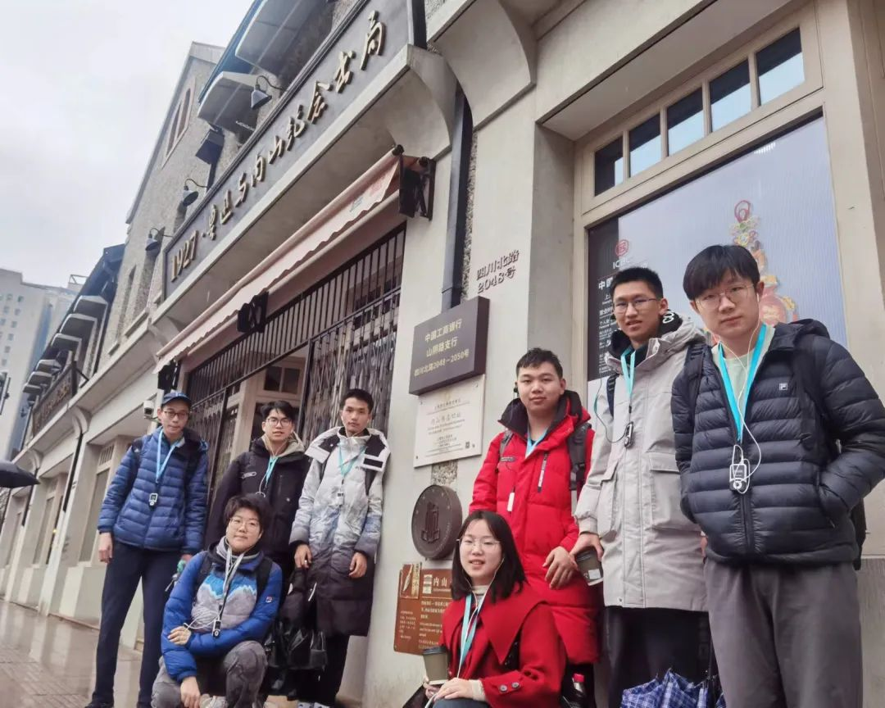
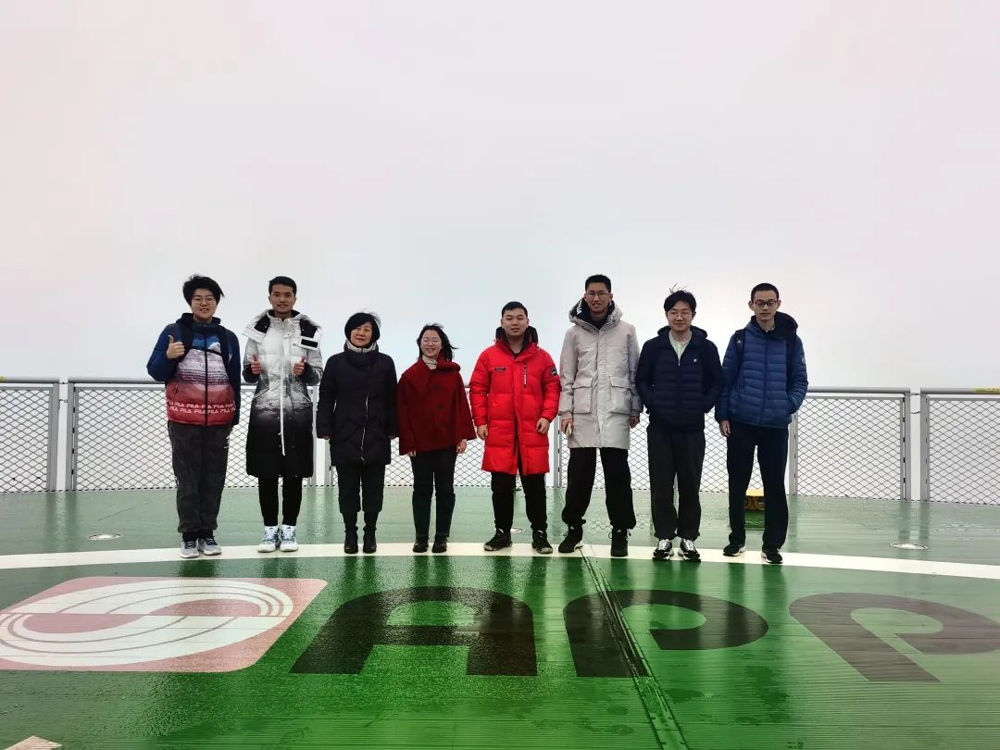
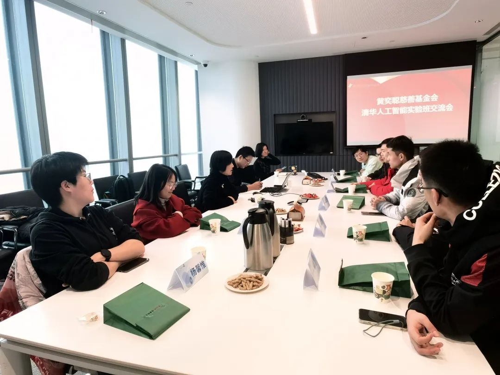
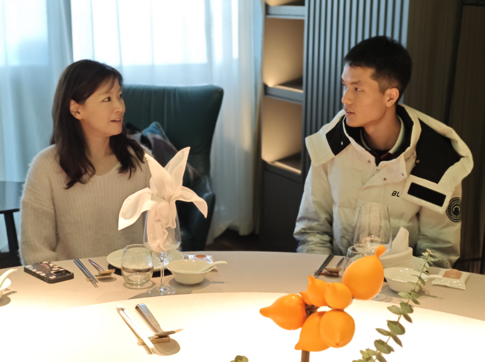
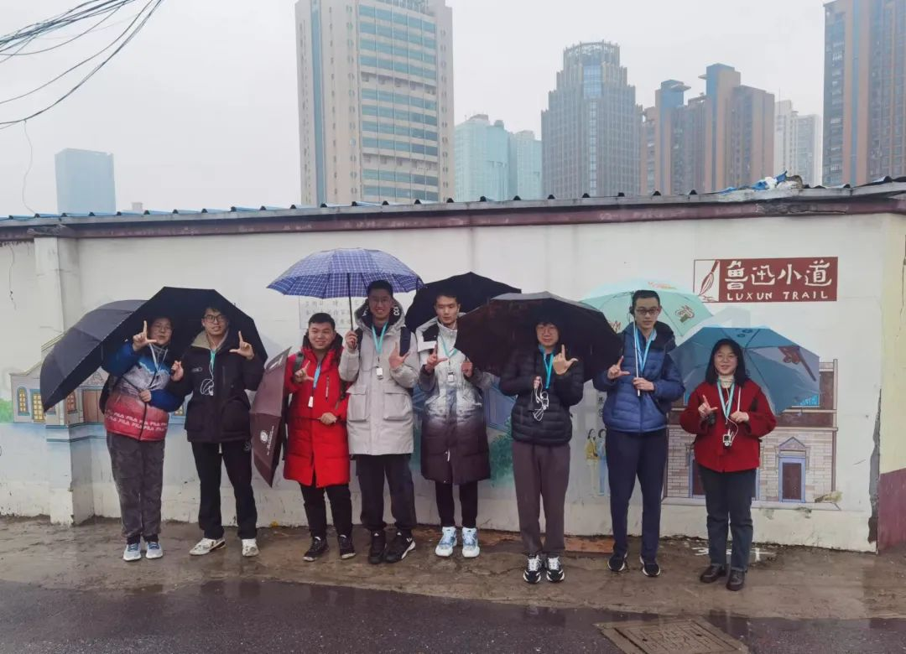

智通研途支队，由清华大学自动化系因材施教计划通用人工智能方向（简称通班）同学组成，致力于深入探索人工智能的前沿发展及其应用。通过本次实践，智通研途支队期望能够汲取先进的人工智能知识与实践经验，了解人工智能技术可能的应用领域，进一步推动成员学术与研究工作。

二月二十三日，“智通研途”实践支队来到黄奕聪基金会交流学习。基金会秘书长苏蔷华女士带着我们参观了白玉兰广场的直升机坪与空中会客厅等标志性场所，让我们领略了浦西第一高楼的风采。之后，苏蔷华女士及其团队与我们座谈。在座谈会上，我们充分了解了黄奕聪先生创办的金光集团的历史以及企业理念，以及基金会所展现的社会责任感和对公益事业的承诺。 

我们就如何利用科技手段更有效地解决社会问题、如何将科技创新融入慈善事业等议题进行了深入的探讨和交流。从医疗健康、金融科技到智能制造，苏蔷华女士结合基金会过往成功案例和正在进行的项目向我们展示了人工智能助力产业升级和经济社会的发展的可能性，拓宽了我们的视野。 

我们还畅聊了通班的现状与成果，交流了支队成员们在人工智能领域的科研进展和前沿认知。苏蔷华女士对于人工智能的伦理、社会影响等议题有着独到的见解，让我们对人工智能的发展有了更全面的认识。

座谈会结束后，基金会理事长虞蘅女士拨冗与我们餐叙。虞蘅女士向我们了解清华通班的人才培养模式以及同学们的学习、生活状况并分享了她的留学经历。

最后，支队还在基金会的协助联络下参观了鲁迅小道，感受了上海这座城市中现代与传统的完美融合，对历史、传承、发展等话题有了更深入的了解和思考。

2006 年，黄杰胜先生和虞蘅女士夫妇将他们的结婚礼金作为启动资金，成立了黄奕聪慈善基金会。黄奕聪基金会以长期助力教育均衡发展、青年人才培养和支持医疗和研究发展三大重点板块，开展并执行了多个品牌公益项目。黄奕聪基金会的工作不仅限于资金支持，还包括组织志愿服务、提高公众意识等。基金会鼓励和组织志愿者参与各类公益活动，通过实际行动传播慈善文化，促进社会和谐。

在教育领域，黄奕聪基金会通过设立奖学金、助学金、改善教育设施等方式，支持教育事业的发展。此外，基金会还重视基础教育的发展，支持建设和改善学校设施，为学生提供更好的学习环境。

2020年朱松纯老师回国，联合清华北大创办通用人工智能班，要打造多位一体的人工智能人才培养社区，为国家形成一支科技王牌军。基金会创办人虞蘅夫妇得知朱老师的计划后，立即决定向清北通班捐款，全力支持通班的发展建设。基金会的捐款用于通班学生的奖学金、学术活动及学科建设等，极大促进了通班的建设和人才培养。

---

感谢黄奕聪基金会的热情款待和深入交流，祝愿通班的老师同学和基金会的交流越来越紧密，也祝愿通班和基金会的发展越来越好！
- 图文 | 自动化系“通班”赴大理实践支队
- 排版 | 汪润
- 审核 | 周偲

