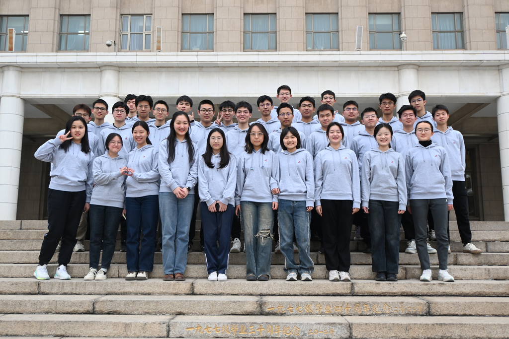
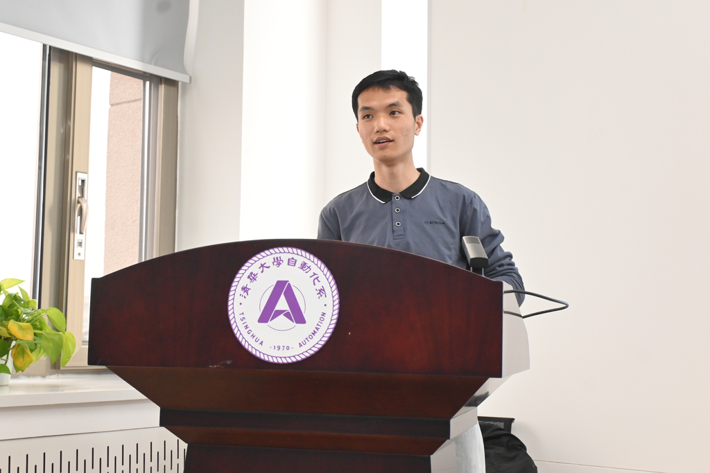
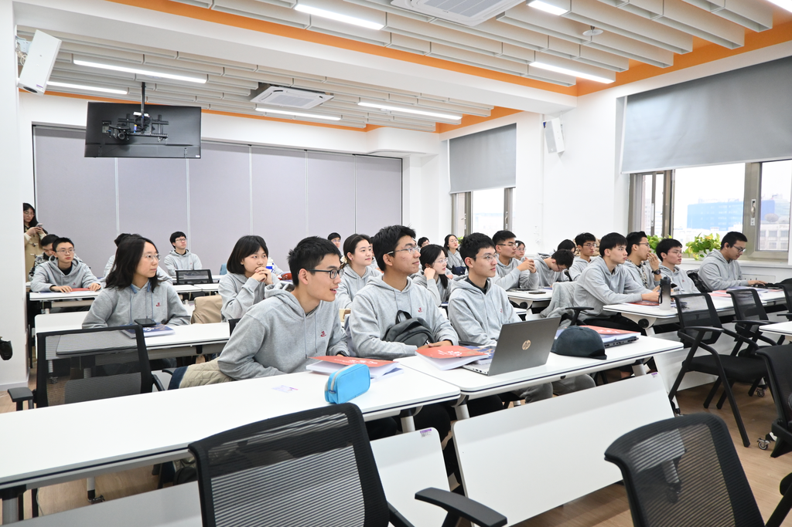
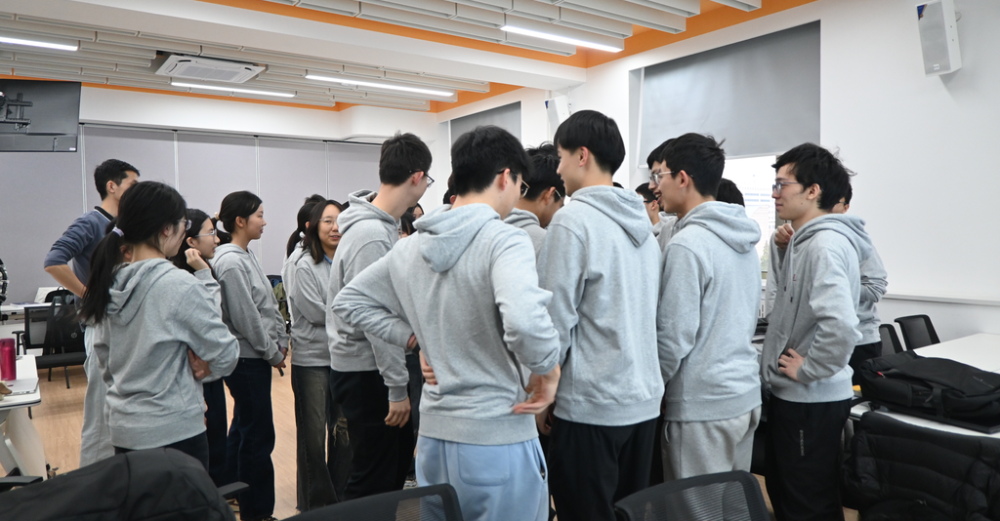
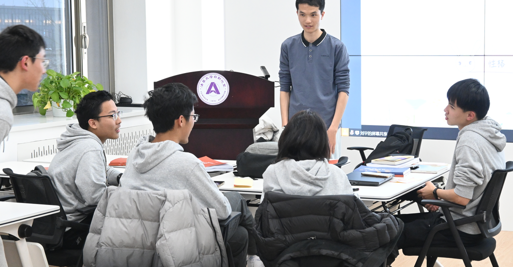
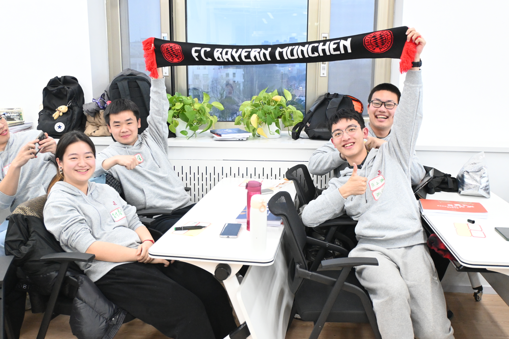
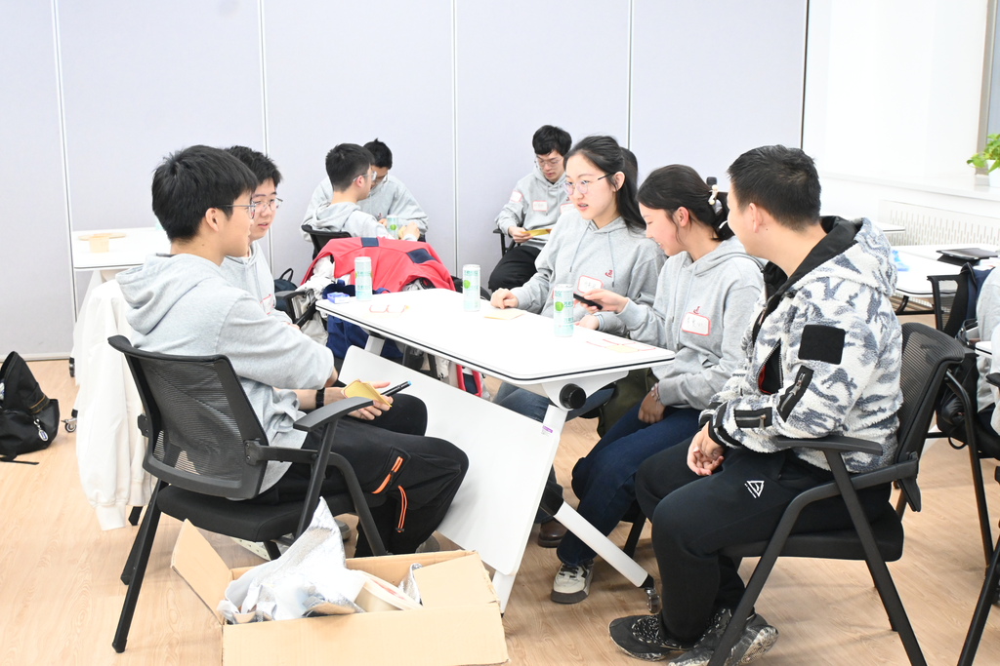
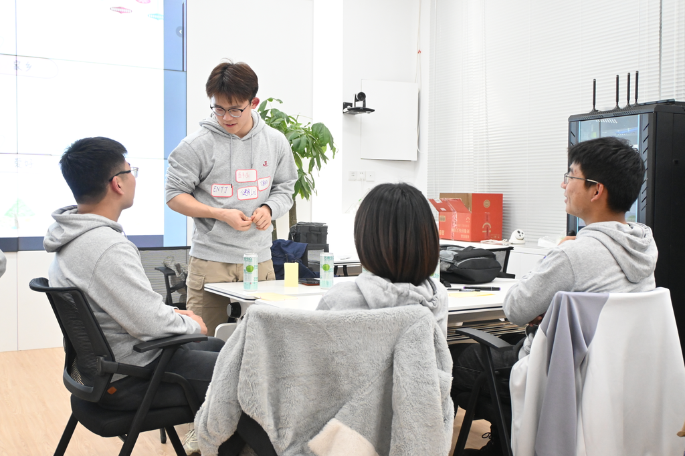
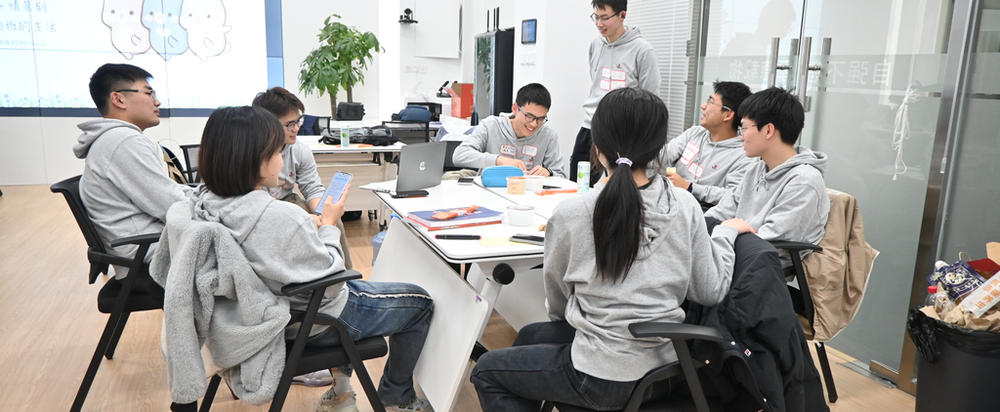

3月10日下午5：00，我们在中央主楼里书写下第一次集体记忆。在班主任刘宇学长的主持下，我们举行了23级通班的第一次班会，“冰释初见，智启未来”。

刘宇学长是20级通班班长，现已保研跟随朱松纯老师读博，研究方向是计算机视觉，经过本科几年的锻炼已从一位“i”人成为一位能够侃侃而谈的引领者，并且在受邀成为23级通班班主任后，接受过清华大学心理指导中心关于班团建设的专业培训。

## PART 01 “微笑握手”

在活泼的BGM中，在刘宇学长的催促之下，全班同学敞开心扉，走到教室中央，与其他同学一一打招呼，微笑握手，并互道姓名，教室里的气氛也由略微尴尬变为了活泼融洽，刘宇学长希望未来我们无论在什么地方相遇，也能像这样微笑问好，让23级通班成为一个温馨的大家庭。

## PART 02 分组介绍 + 晚餐

为了进一步破冰、增进理解，同学们随机分组互相介绍性格、家乡、爱好，几位学长也热情地参与其中，大家围坐着共进晚餐，随意闲聊，可谓其乐融融。

最后，每组选出一位同学介绍全组同学。在欢声笑语中，同学们多元化的特征让大家愈加期待未来在通班的无限可能。

## PART 03 情景剧演绎

大家充分发挥自己的想象力，每组在15分钟内排练出一幕未来在通班生活的情景剧。或用A*算法实现真实的通用人工智能，或与未来的ChatGPT斗智斗勇……同学们幽默活泼而贴近现实的演绎让大家对未来又多了些许期待，同时也展现了大家面对可能的挑战时自信的姿态。

作为“奖励”，情景剧的优胜组选择了让刘宇学长表演才艺，本次活动也就在学长一曲《彩虹》中步入尾声，希望我们的通班大家庭能在未来的学习、生活、实践中，在通用人工智能领域共同绘出一道绚丽耀眼的彩虹。

## 我们的留言

- 非常好班会，使我e指数暴涨。感谢尬而有趣的小游戏让我把通班的同学基本认识了一下，也深入了解其中的一些同学，现场氛围真是好一派尴尬而其乐融融啊！现在很是对往后的通班生活充满着向往呐！

- 学长好有耐心，破冰游戏虽然有点难度但是也看出来很有心啦～

- 感谢多多少少真真假假受过专业培训的lygg设计的实实在在尴尬的小游戏真真正正地让我们将欢笑刻在了3月10日下午5点的主楼班会，也祝愿大家日后的时光都能过得快快乐乐从从容容！

- 15min排练小短剧相当震撼！在这么短的时间里面还保证了比较高的质量，很让人惊讶。

---

- 编辑：谭雯心
- 摄影：张竞择
- 审核：刘宇 张竞择