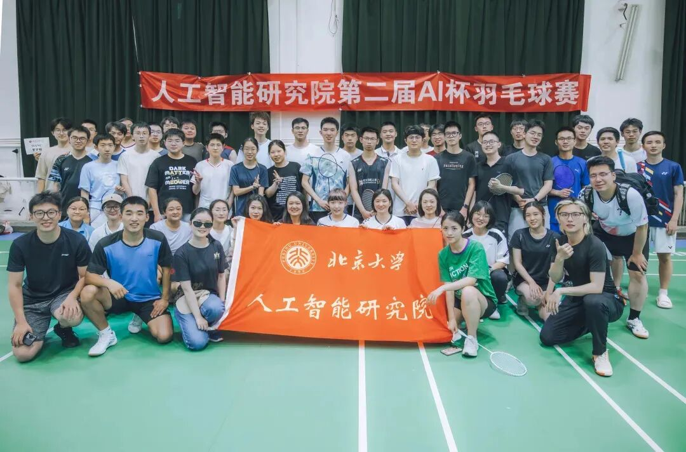
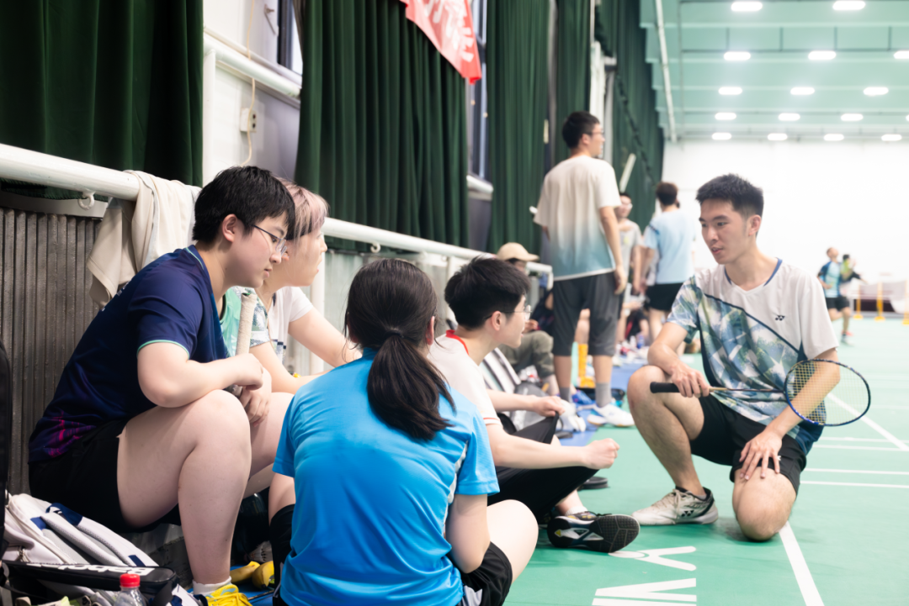
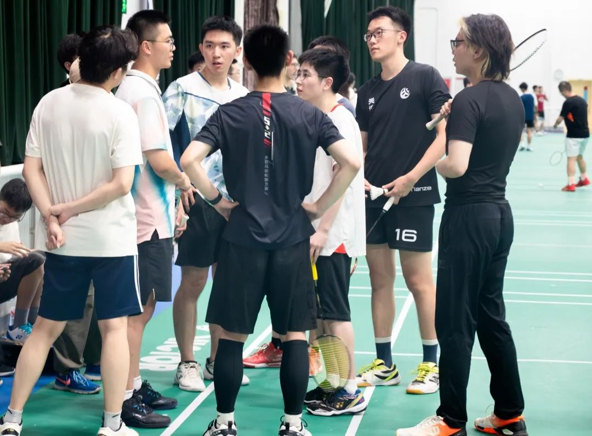
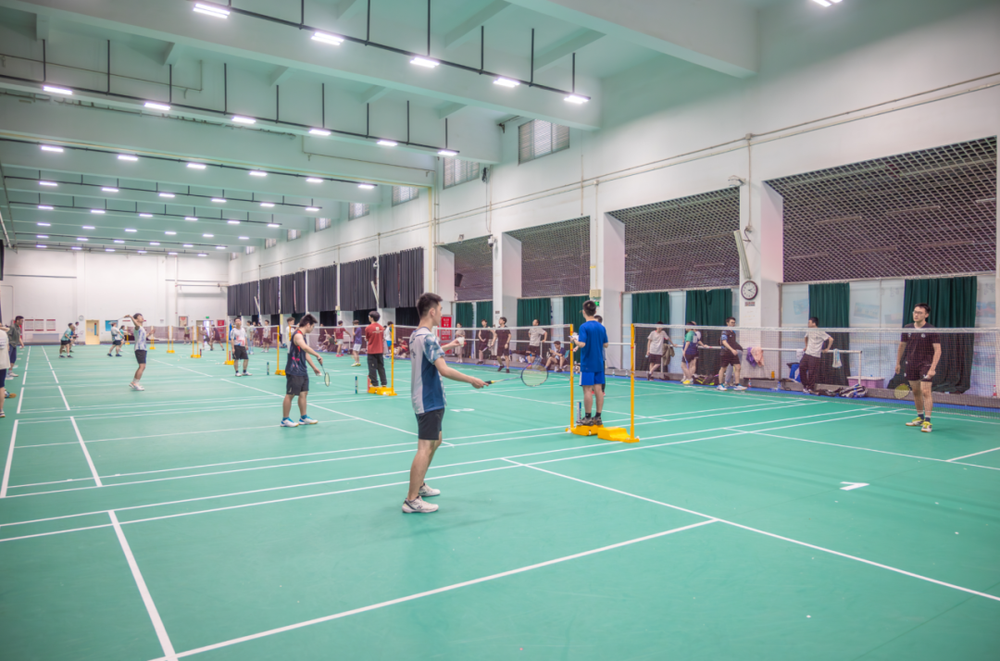

6月22日下午，为进一步拉近师生距离、凝聚班级力量、促进全面发展，北京大学人工智能研究院在五四羽毛球场举办第二届 “AI 杯” 羽毛球赛，6支代表队、60余名师生齐聚赛场。这场赛事不仅延续了首届AI 杯的精彩赛况，更在竞技水平、赛事保障等多个方面实现了突破，充分展现了师生们对体育运动的热爱和对团队精神的追求。
本次比赛共有6支队伍参赛，分别为“MANC”、“拼好队”、“羽毛球体验组”、“有思路队”、“源神启动”和“通班的筒子们”。各队伍由人工智能研究院本科生（通班）与研究生按班级或课题组组成，队内至少包括一名教师，每队最多含有 12 名队员。比赛采用混合团体赛制，包含男子单打1、女子单打、男子双打、男子单打2、混合双打5个单项。小组赛各单项采用单局21分决胜制，封顶不加球；半决赛单项采用三局两胜制，决赛和季军争夺赛单项采用单局决胜制。每局均为21分制，封顶不加球。
开幕式上，各队签到并确认参赛队员及规则，全体人员合影留念，共同见证这一重要时刻。田虎同老师开球，各队热身完毕，便全身心投入这场夏日运动盛宴。

## 比赛现场

男单：力量与激情的碰撞男单对决力量感十足，选手们高挑近端，诱敌深入，随后以一记强劲的扣杀锁定优势。转身反手接球，连续扣杀与化解，全场调动对手，勾对角战术运用得炉火纯青。强强对话中，选手们用汗水诠释着对胜利的渴望，为观众奉献了一场场视觉盛宴。

女单：灵活多变，尽显风采在女单比赛中，选手们展现出令人惊叹的技巧与智慧。左攻右接，远拉近接，她们在赛场上精准地找到扣杀时机，专打对角死角，力量与技术完美融合。脚步的快速变换和舒展的身形，让每一次击球都充满了美感和力量。场边观众们被选手们的精彩表现深深吸引，不断发出 “好球” 的呼声，为她们加油助威，掌声与欢呼声交织在一起，营造出热烈的赛场氛围。

男双：默契配合，战术多样男双项目中，选手们展现了默契的配合与多样的战术。或前后场紧密协作，或左右开弓，进攻防守变换自如。每一次漂亮的得分后，队友们击掌庆祝，大声相互打气，将团队协作的力量展现得淋漓尽致。

混双：师生携手，激情四溢混双比赛更是精彩纷呈，老师与学生齐上阵，变化丰富。左右手开弓无死角，飞扑接球全力以赴，双方在网前与底线之间灵活移动，展现了极高的竞技水平和团队默契。

比赛现场，1号场地用于热身训练，2、3号场地是激烈对决的舞台。男女单打交替进行，让比赛节奏紧凑而充满变化。比赛结束后，选手们友好示意，体现了体育精神和对对手的尊重。场边观众们热情高涨，为每一球的精彩表现欢呼，为选手们加油鼓劲，整个赛场洋溢着热烈而温馨的氛围。

## 总结鸣谢

第二届 “AI 杯” 羽毛球赛的成功举办，不仅为师生提供了一个展示自我、增进交流的平台，更增强了班级内部的凝聚力，丰富了师生的业余生活。比赛的成功离不开每一位参赛者的努力和付出，也离不开组委会的精心筹备和组织。本次AI院师生羽毛球友谊赛圆满结束，我们期待下一届 “AI 杯” 羽毛球赛能带来更多惊喜。

