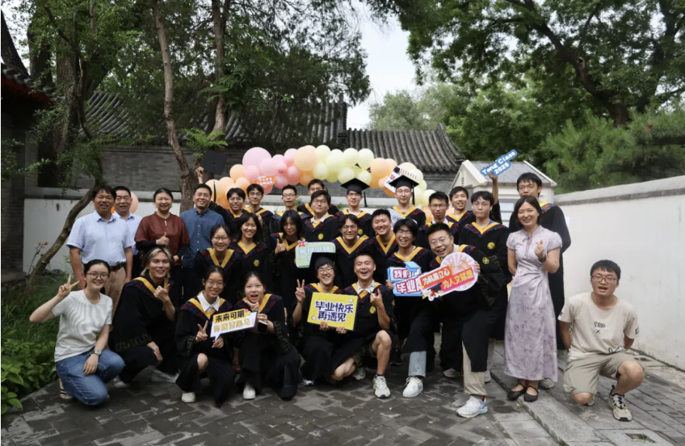
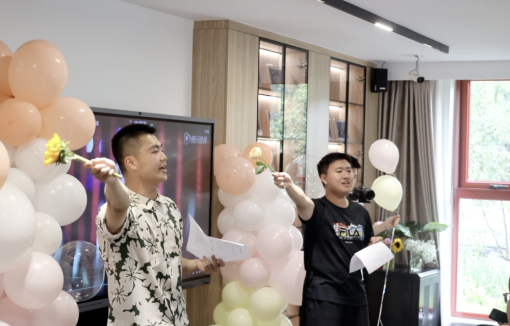
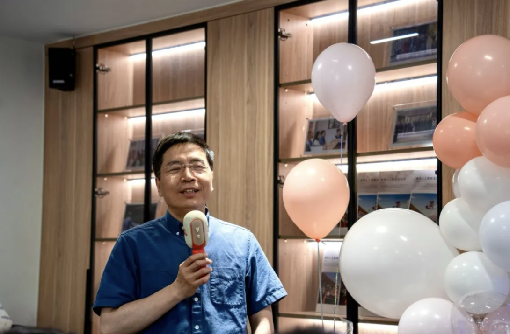
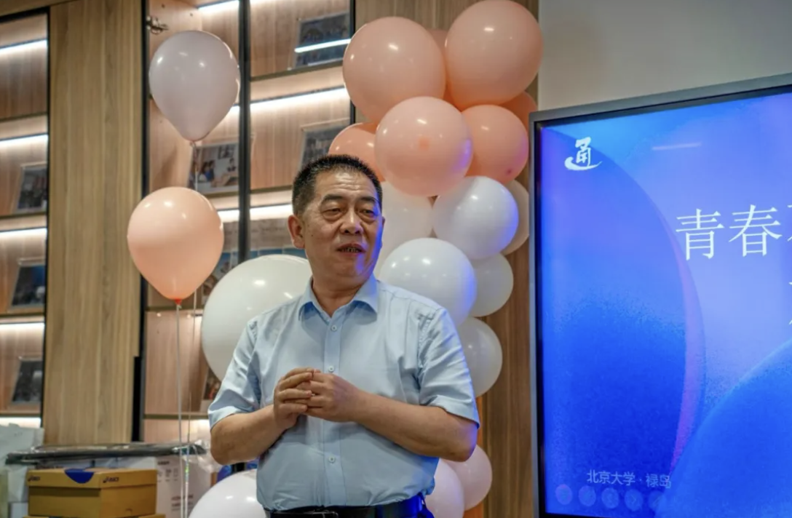
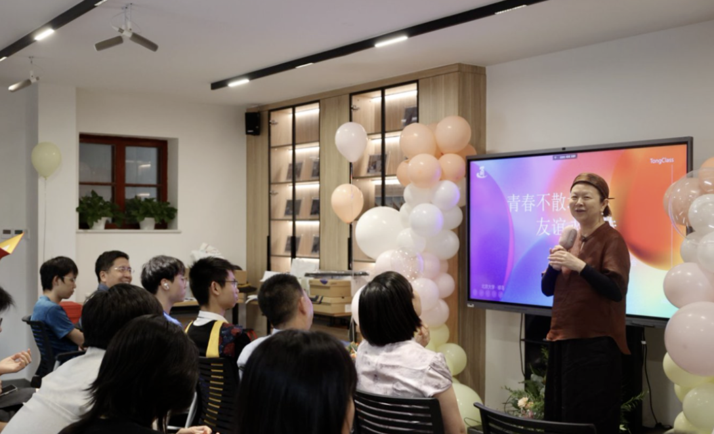
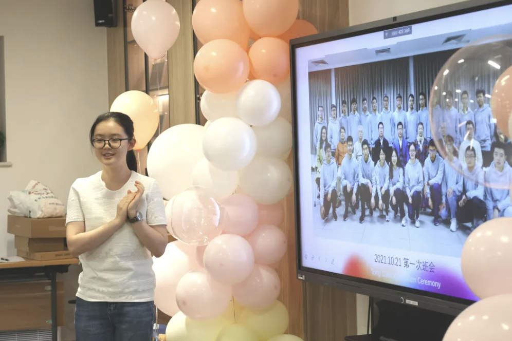
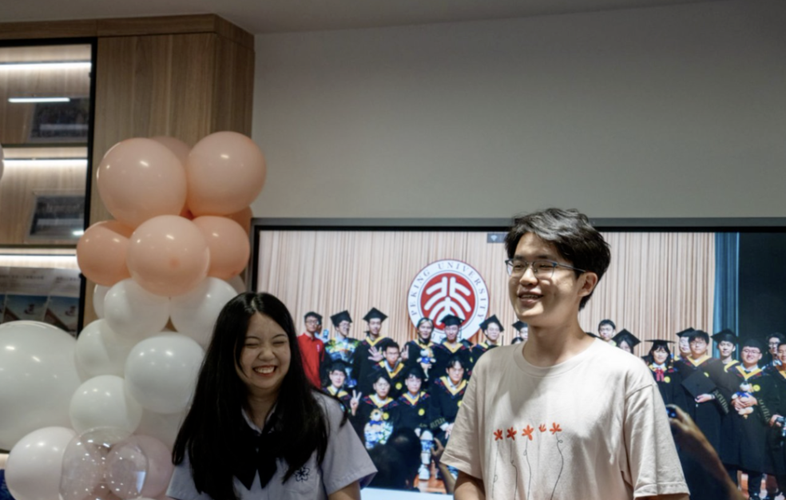
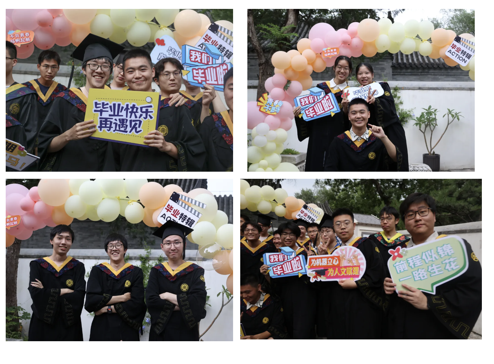
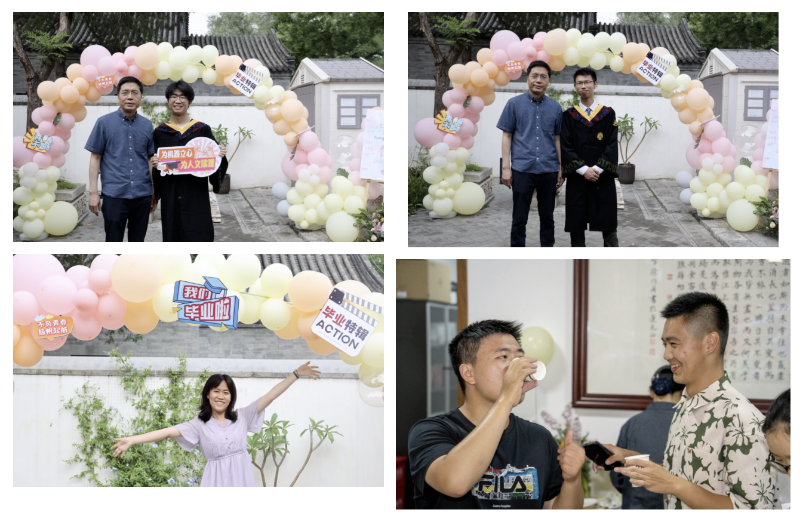
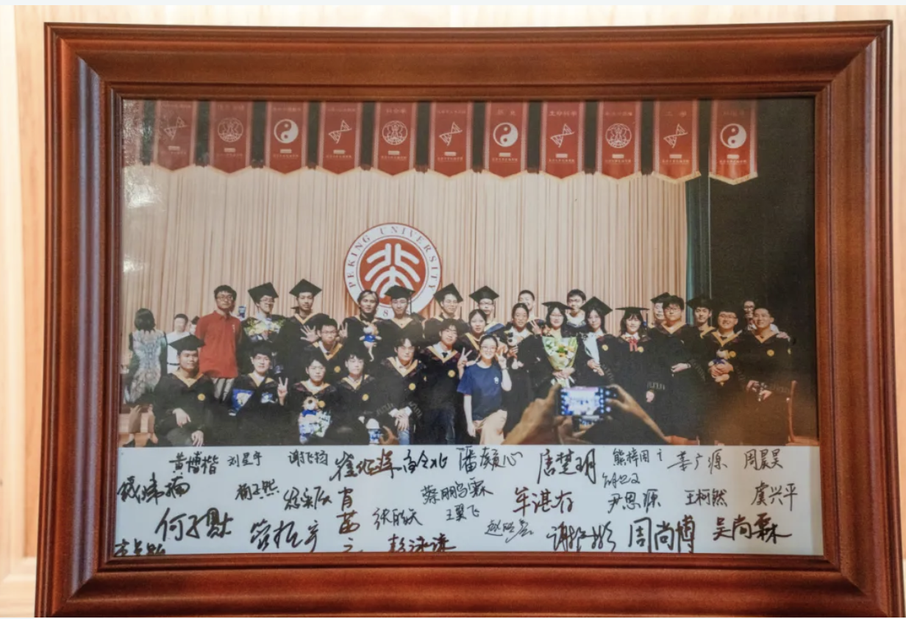

2025年7月2日傍晚，北京大学元培学院2025届通用人工智能实验班（简称“通班”）毕业晚会在禄岛举行，活动分为上半场和下半场，上半场由通班25届毕业生崔绍洋主持，分为毕业生合唱、教师代表发言、毕业生代表发言和毕业生表演几个环节，下半场为集体舞会和联欢活动。晚会在谢卢彬和王柯然同学《老男孩》的悠扬歌声中开场。

人工智能研究院院长朱松纯教授寄语毕业生要坚守理想、把握机遇、心系母校。朱院长结合自身青年时期的经历，与毕业生们亲切交流。他谈到，优秀人才未必被即时认可是人生与社会的常态，勉励大家保持自信与定力，切勿轻易放弃理想。针对未来发展的不确定性，朱院长指出波动中孕育机遇，嘱咐大家要不断修炼自身，培养成熟心智与开阔格局，积极探索适合的事业道路。临别之际，他特别叮嘱毕业生离校后仍要主动与母校师生保持联络，珍视并延续这份弥足珍贵的情谊。朱院长的发言饱含推心置腹的分享与殷切的嘱托，为毕业学子点亮了前行的方向。

元培学院副院长刘建波教授在发言中首先向支持通班建设的教师们表达了诚挚感谢。在分享近期参与相关论坛的思考时，刘院长指出，把握机遇需要提前做好准备，希望同学们在时代的浪潮中为真正的创新做好充分的准备，此外，他指出当下人工智能的浪潮虽热，但不希望同学们一味跟风追潮流、赶时髦，而要扎扎实实地沉下心来做一些基础性的工作也同样重要。刘院长的发言既有前瞻的谋虑也有务实的方略。最后，刘院长嘱咐同学们要珍惜北大的平台和师友、注重合作，借助环境的力量做出更多成绩。

人工智能研究院副院长李文新教授与同学们分享了自己在北大的三段成长故事。她回忆说，大学四年让她明白了很多人生道理：从大一买不到火车票时第一次感受到的现实差距，到大三看到教授摆摊时领悟到的"放下身段"的勇气，再到大四学会游泳后收获的"只要敢尝试就能成功"的信心。李院长用这些亲身经历告诉并鼓励同学们，人生路上总会遇到各种困难，但要保持信念，勇敢前行，要对未知的未来充满希望。

25届通班班长牟湛存作为毕业生代表之一发言，回望在通班度过的宝贵时光，他对通班带给他的归属感表达了深切感激。他分享了作为毕业生所感受到的时代责任，激励同学们在学业和职业道路上不断追求进步，并对未来积极保持联系表达了美好的愿望。同时，他也坦诚分享了自己曾经经历的迷茫期，鼓励同学们不必因外界的评价或遥远的目标而感到压抑，要积极寻找生命中的变化和流动，探索和追求真正让自己心动的事物，以此激励同学们找到自己的方向。

通班的另一位班长肖茜之带大家回顾了通班从大一至毕业学业内外的种种。不长不短的本科时光里，既有学业带来的挑战、也有学术活动带来的启悟，还有团建为大家增进的友谊。她特别提到了与人工智能研究院和通班相关的各种实践活动，如科技节、学术交流会，以及与行业专家的互动等等，而班级组织的各种班会、经验分享和趣味团建活动则增强了班级凝聚力，促进了同学之间的情感联系。她对未来满怀期待，对班级抱有深厚的情感，回顾这段时光，同学们都感受到了这段经历和友情的珍贵。

此后，刘星宇和刘若蕾共同演绎了一首歌《达尼亚》，在悠扬动听的曲调中上半场活动落下帷幕。所有参会师生在禄岛院落中专门搭建的气球拱门前合影，留下了一张张珍贵的毕业影像。

下半场，平日的教室变身摇摆舞池，通班学子在两位舞蹈老师的带领下跳出青春乐章。当复古爵士乐撞上毕业季，会擦出怎样的火花？通班学子们一个个化身舞林高手，在摇曳灯影中掀起一场即兴摇摆舞风暴。柔和的灯光包裹着满场跃动的身影，地板在爵士鼓点中微微震颤，欢笑声混着舞步声掀翻屋顶——即兴搭档的学子们连成流动的彩虹，此刻的他们是踩着快乐律动的追风少年，在这一刻化作舞池里最闪亮的星。

当最后一曲余韵在禄岛的夜色中飘散，当摇曳的灯影定格了青春最恣意的姿态，这个充满欢笑与感动的夜晚，记录着大家最真挚的情感和珍贵的回忆，也终将封存于通班25届每一位学子的记忆深处。

四年的校园时光里，教室、图书馆、实验室都见证了你们的成长与蜕变。老师们的悉心指导，同学间的深厚友谊，都将成为你们继续前行的动力。

此去山高水长，愿你们怀揣北大通班的火种，让智慧的光芒在更广阔的天空下闪耀；此去星辰大海，愿你们心系这座精神岛屿的坐标，任凭风浪激荡，心中的航向始终清晰如昨。

愿你们带着祝福，怀揣理想与信念，在更广阔的天地中勇敢追梦。祝愿你们都能在未来的舞台上，书写属于自己的精彩人生！

毕业快乐，愿大家前程锦绣，友谊常青！

---

